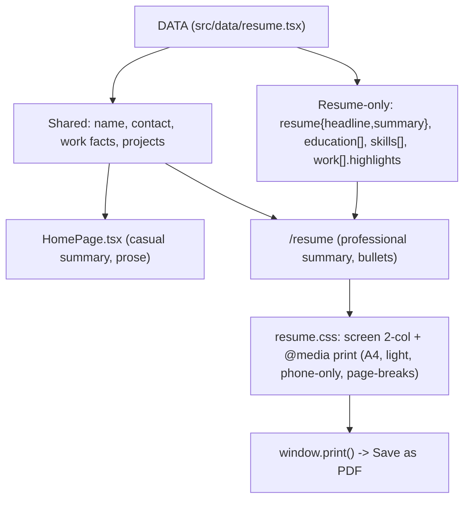

# feat: Add /resume page with print-to-PDF

## Summary

Add a standalone `/resume` route that renders Hitesh's resume as a monochrome,
sidebar-forward document (tinted sidebar with photo + a dense right column),
driven by the existing `DATA` config in `src/data/resume.tsx` extended with a
professional summary, skills, education, and per-role blurbs + highlight
bullets. A "Print / Download PDF" button calls
`window.print()` against a dedicated print stylesheet (A4, light, page-break
aware) so the browser's Save-as-PDF produces the deliverable. Built in five
dependency-ordered units mapped to the four brainstorm phases; final copy is
authored last, with user review.

## Problem Frame

The Astro + Starfolio migration (see the prior migration brainstorm,
`docs/brainstorms/website-revamp-astro-starfolio-requirements.md`) scoped
`/resume` as a WIP placeholder for "real resume + PDF later," but that
placeholder was never landed — `src/pages/` today holds only `index.astro` and
`404.astro`, and `src/components/navbar.tsx` renders only social icons + a theme
toggle (no Home/Resume nav entries). So this is a net-new route.

The site's content lives in one typed config (`DATA` in `src/data/resume.tsx`),
but it's shaped for the homepage story: `DATA.summary` is casual and personal,
`DATA.work[]` entries are long narrative prose rather than scannable bullets, and
there is no `education` or `skills` data. A resume needs a different shape and
voice than the portfolio page it shares a source with.

---

## Key Technical Decisions

- **Extend `DATA` additively; don't fork it** (see origin). New resume fields
  live on the existing `DATA` object so career facts have one source and can't
  drift. `resume.summary` is a separate professional summary so the resume never
  inherits the homepage's casual `DATA.summary`. The homepage keeps reading its
  own fields and ignores the additions (`highlights` is optional per work entry).
- **New minimal layout, not a stripped shared layout.** `src/layouts/Layout.astro`
  hardcodes the FlickeringGrid header, the `NavbarIsland` dock, and a narrow
  `max-w-2xl` wrapper. Rather than thread conditionals through it, add a
  dedicated `src/layouts/ResumeLayout.astro` that reuses the SEO/OG head pattern
  but drops the grid, dock, and narrow wrapper — keeping the resume's chrome
  isolated.
- **Pure static Astro page, no React island.** The resume is static content;
  render it as a `.astro` page (`prerender = true`, matching `index.astro`) with
  a tiny inline `onclick="window.print()"` script for the button. No hydration,
  smallest weight, best print fidelity.
- **Light-only via layout, not a toggle.** `Layout.astro`'s inline FOUC script
  is what adds the `.dark` class to `<html>`. `ResumeLayout.astro` omits that
  script, so the resume page always renders light — matching print and the
  document feel — without needing a toggle control.
- **Dedicated print stylesheet over scattered `print:` utilities.** The print
  layer needs `@page { size: A4 }` and `break-inside: avoid` rules that aren't
  expressible as Tailwind utilities, so put print + document rules in one scoped
  stylesheet (`src/styles/resume.css`) imported by the page. Tailwind `print:`
  utilities may still be used inline for simple show/hide.
- **Phone is print-only via CSS.** The phone number lives in the markup inside a
  `.print-only` element (`display:none` on screen, shown in `@media print`), so
  the downloaded PDF carries it but the crawlable page never does.

---

## High-Level Technical Design

Source-of-truth fan-out — one config feeds both surfaces; the resume reads
shared facts plus resume-only fields, the homepage ignores the additions:



Rendering split: `ResumeLayout.astro` (head/SEO, light-only, no chrome) wraps
`resume.astro` (header + two columns), which imports `resume.css`.

---

## Output Structure

New and touched files:

```text
src/
  data/resume.tsx          # MODIFY: add resume{}, education[], skills[], work[].highlights
  layouts/
    Layout.astro           # unchanged
    ResumeLayout.astro     # NEW: minimal light-only doc layout
  pages/
    resume.astro           # NEW: /resume route, two-column document
  styles/
    global.css             # unchanged
    resume.css             # NEW: document + print (@page A4) styles
```

---

## Implementation Units

### U1. Extend DATA with the resume schema

- **Goal:** Add the resume-specific fields to `DATA` so the page has data to
  render. Structural/known values are populated here; prose copy (professional
  summary, per-role highlights) lands as first-draft placeholders, finalized in
  U5.
- **Requirements:** R1, R2, R3 (also unblocks R12–R14).
- **Dependencies:** none.
- **Files:** `src/data/resume.tsx`.
- **Approach:** Add three top-level fields and one per-entry field to the `DATA`
  object (which is `as const`):
  - `resume: { headline, summary }` — `headline` proposed "Senior Architect ·
    Frontend & UI Engineering"; `summary` a professional paragraph distinct from
    `DATA.summary`.
  - `education: [{ school, degree, field, start, end, location }]` — seed with
    the confirmed entry: B.Tech, Information Technology — SKIT, Jaipur,
    2010–2014 (see Assumptions for name/GPA confirmation).
  - `skills` — grouped as `{ label, items[] }[]` (Languages, Frameworks &
    Libraries, Testing, Tools), compiled from the current stack + old-resume
    proficiencies, modernized (drop stale-only tools).
  - `highlights?: string[]` on each `work[]` entry — achievement bullets;
    optional so the homepage is unaffected.
  - Contact data: set the currently-empty `DATA.location` to "Bengaluru, India"
    (the city the header renders) and `DATA.contact.tel` to the real phone (used
    print-only per R11). Both values are confirmed with the user in U5 — U3/U4
    read them from `DATA` rather than hardcoding.
  Keep the homepage (`src/components/HomePage.tsx`) untouched; confirm it still
  reads only its existing fields.
- **Patterns to follow:** the existing `DATA` shape and `as const` export in
  `src/data/resume.tsx`; mirror the object style of `work[]` / `projects[]`.
- **Test scenarios:** Test expectation: none — typed data change, no test runner
  configured. Verified in U3/U5 via render + `pnpm build` (type-check).
- **Verification:** `pnpm build` succeeds (TS accepts the new fields); the
  homepage renders unchanged in `pnpm dev`.

### U2. Minimal resume layout

- **Goal:** A standalone document layout with the head/SEO but none of the site
  chrome, rendering light-only.
- **Requirements:** R6, R8.
- **Dependencies:** none.
- **Files:** `src/layouts/ResumeLayout.astro`.
- **Approach:** Adapt the head from `src/layouts/Layout.astro` — charset,
  viewport, favicon, and the SEO/OG/Twitter meta (reuse the `title`/`description`
  props and `CONFIG.seo.titleTemplate`). Emit the theme CSS custom properties as
  Layout does, but **only the light `:root` block** and **omit the FOUC
  `.dark`-toggle inline script**, so the page stays light. Body is a bare
  `<slot />` — no FlickeringGrid, no `NavbarIsland`, no `max-w-2xl` wrapper. Set
  a document-appropriate wider container in the page/stylesheet, not here.
  Import `src/styles/global.css` (as `Layout.astro` does) so Tailwind base
  styles and the Outfit/Geist fonts are available to the resume markup.
- **Patterns to follow:** `src/layouts/Layout.astro` head and `set:html` theme
  block; keep the same `Props` interface shape (`title`, `description`, `image`,
  `canonicalURL`).
- **Test scenarios:** Test expectation: none — layout scaffold, no behavior;
  exercised by U3.
- **Verification:** A trivial page using this layout renders with correct
  `<title>`/meta, no dock, no grid, and light colors regardless of OS dark mode.

### U3. Resume page and two-column layout (screen)

- **Goal:** The `/resume` route rendering the header + two-column document from
  `DATA`, responsive to single column on mobile.
- **Requirements:** R4, R5, R7, R6 (back-link), R14 (web contact fields).
- **Dependencies:** U1, U2.
- **Files:** `src/pages/resume.astro`, `src/styles/resume.css` (screen rules;
  print rules added in U4).
- **Approach:** Create `resume.astro` with `export const prerender = true;`
  using `ResumeLayout`. Structure:
  - Header: name + `resume.headline` on the left; contact block (email, website
    `hiteshkumar.dev`, city "Bengaluru, India", LinkedIn, GitHub) on the right.
    Include a "← back to hiteshkumar.dev" link and a "Print / Download PDF"
    button (wired in U4).
  - Two-column body: left = Summary (`resume.summary`), Skills (`skills`),
    Education (`education`); right = Experience (`work[]` with `title`,
    `company`, `start`–`end`, and `highlights` bullets).
  - Heading semantics: name = `<h1>`, each section label (Summary / Skills /
    Education / Experience) = `<h2>`, each role title = `<h3>`. The underline is
    CSS on those headings, not on non-heading text — this gives a correct PDF
    outline and screen-reader reading order.
  - `resume.css` sets a document container width (wider than `max-w-2xl`), the
    CSS-grid/flex two columns, the underlined-heading treatment, a single-column
    collapse at a small breakpoint, and a visible `:focus-visible` outline for
    the print button and back-link.
  Read all values from `DATA`; no hardcoded copy in markup.
- **Patterns to follow:** `src/pages/index.astro` prerender + layout usage;
  section heading/typography feel from the reference image; monochrome tokens
  from `global.css`.
- **Test scenarios:** Test expectation: none — static render, no test runner.
  Verify by inspection/build:
  - Happy path: `/resume` renders header, both columns, all six roles with
    bullets, education, skills, from `DATA`.
  - Edge: a `work` entry without `highlights` renders its heading/dates without
    an empty bullet list; long role text wraps without overflow.
  - Responsive: below the breakpoint the two columns stack to one.
- **Verification:** `pnpm dev` shows `/resume` correctly; `pnpm build` +
  `pnpm preview` serve it; no console errors; no dock/grid present.

### U4. Print / PDF layer and print button

- **Goal:** Clicking the button opens the browser print dialog; the printed
  output is a clean A4 PDF with the right things shown/hidden and no split roles.
- **Requirements:** R9, R10, R11.
- **Dependencies:** U3.
- **Files:** `src/pages/resume.astro` (button script + `.print-only` phone
  markup), `src/styles/resume.css` (`@media print`).
- **Approach:** Add an inline `onclick="window.print()"` handler on the button
  (no framework needed). In `resume.css` `@media print`:
  - `@page { size: A4; margin: <sensible>; }`, force light colors, set a
    print-appropriate base font size.
  - Hide the print button and the back-link (e.g., a `.no-print` class).
  - Reveal the phone number: `.print-only { display: none; }` on screen,
    shown inside `@media print`.
  - Print-visible links: the website and social entries render as resolvable
    text in print (e.g. `github.com/hk-skit`, `linkedin.com/in/smellycode`) via a
    `.print-only` URL suffix mirroring the phone pattern, so the PDF carries
    reachable addresses rather than dead label text.
  - `break-inside: avoid;` on each experience role block so a role never splits
    across a page; allow natural pagination between roles.
- **Patterns to follow:** standard `@media print` + `@page`; consult the
  `modern-web-guidance` skill for current print-CSS/`break-inside` guidance.
- **Test scenarios:** Test expectation: none — CSS/print behavior, verified via
  browser print preview:
  - Print preview shows A4, light, two columns intact.
  - Button and back-link are absent from the printed output; phone number is
    present in print, absent on screen (confirm in page source / DOM on screen).
  - No single role is split across a page boundary; content paginates between
    roles.
- **Verification:** In `pnpm preview`, the button opens the print dialog;
  "Save as PDF" yields a clean multi-page A4 PDF matching the above.

### U5. Content pass — finalize copy (content phase)

- **Goal:** Replace first-draft copy with final, reviewed content: the
  professional summary, per-role `highlights`, and skills wording.
- **Requirements:** R12, R13 (and finalizes R1's `summary`/`highlights`).
- **Dependencies:** U1 (fields exist), U3/U4 (page visible for review).
- **Files:** `src/data/resume.tsx`.
- **Approach:** Author the professional `resume.summary`; distill each
  `work[]` description into achievement `highlights` — recent roles
  (Tectonic/Virgio/Myntra) detailed, older roles (Greytip/Eventifier/In Time Tec)
  concise; natural overall length (start lean). Career facts (company, title,
  dates, location) come from current `DATA.work`; the old resume supplies
  education and bullet material only — stale old-resume dates/roles are not
  carried over. Resolve the two content confirmations (see Open Questions) with
  the user during this pass.
- **Execution note:** This is the collaborative content phase — draft, review
  with the user, refine. Do not treat first-pass copy as final.
- **Patterns to follow:** tone of a senior IC/lead resume; quantified outcomes
  already present in `DATA.work` (100k+ installs, 2-month launch, team size).
- **Test scenarios:** Test expectation: none — copy change. Verified by review +
  build.
- **Verification:** User signs off on the rendered `/resume`; `pnpm build`
  passes; the printed PDF reads cleanly end-to-end.

---

## Scope Boundaries

In scope: the `/resume` route, the standalone light-only two-column document,
the print-to-PDF layer, and the resume content.

### Deferred to Follow-Up Work

- Discoverability — a navbar-dock entry or a homepage link to `/resume`
  (reachable by direct URL for now; user places a link later).
- Build-time one-click PDF (headless render in CI) — enhancement on top of R9.
- Optional resume sections — Writing / Selected Articles, Awards & Recognition,
  Certifications, Speaking / Talks.
- Dark mode on the resume page.
- Automated test setup (no runner exists today; adding one is its own task).

### Rejected (see origin)

- Committed static PDF in `public/` — drifts from the live page.
- Client-side PDF rasterization (jsPDF / html2canvas) — heavy, non-selectable
  text, separate render path.

---

## Assumptions

- Education from the user's old-resume image: B.Tech, Information Technology —
  SKIT, Jaipur, 2010–2014. Institution full name and any GPA/honours to confirm
  in U5.
- `hk.skit@gmail.com` is the intended public contact email (matches site + old
  resume).
- Current `DATA.work` is the accurate, up-to-date record of roles and dates; the
  old resume is stale and used only for education + bullet source material.
- Static GitHub Pages hosting (`output: 'static'`, no adapter) — no request-time
  server, so PDF generation is client-side (print). Confirmed in
  `astro.config.mjs`.
- Adding a page auto-includes it in the sitemap (`@astrojs/sitemap`); acceptable
  — the resume is meant to be public.

---

## Open Questions

Resolve during the content phase (U5), not blocking earlier units:

- Confirm the education institution's full/expanded name (SKIT) and whether to
  spell it out; confirm no GPA/honours line is wanted.
- Confirm the headline wording ("Senior Architect · Frontend & UI Engineering"
  or an alternative).
- Confirm the phone-number value for the print-only field (from the old resume:
  `+91 9660675398`).

Deferred to implementation:

- Exact `@page` margins and print base font size (tune in print preview).
- The concrete document container width and the mobile breakpoint value.
- Whether to expose an A4/Letter toggle (default A4; revisit only if wanted).

---

## Sources & Research

- Origin requirements: `docs/brainstorms/2026-08-18-resume-page-pdf-requirements.md`.
- Prior migration plan (context for why `/resume` was deferred):
  `docs/plans/2026-05-27-001-feat-website-astro-starfolio-migration-plan.md`.
- Grounding dossier (verified repo quotes with `file:line`):
  `/tmp/compound-engineering/ce-brainstorm/resume-pdf/grounding.md`.
- Implementer reference for print CSS specifics: the `modern-web-guidance` skill
  (`@media print`, `@page`, `break-inside`).
